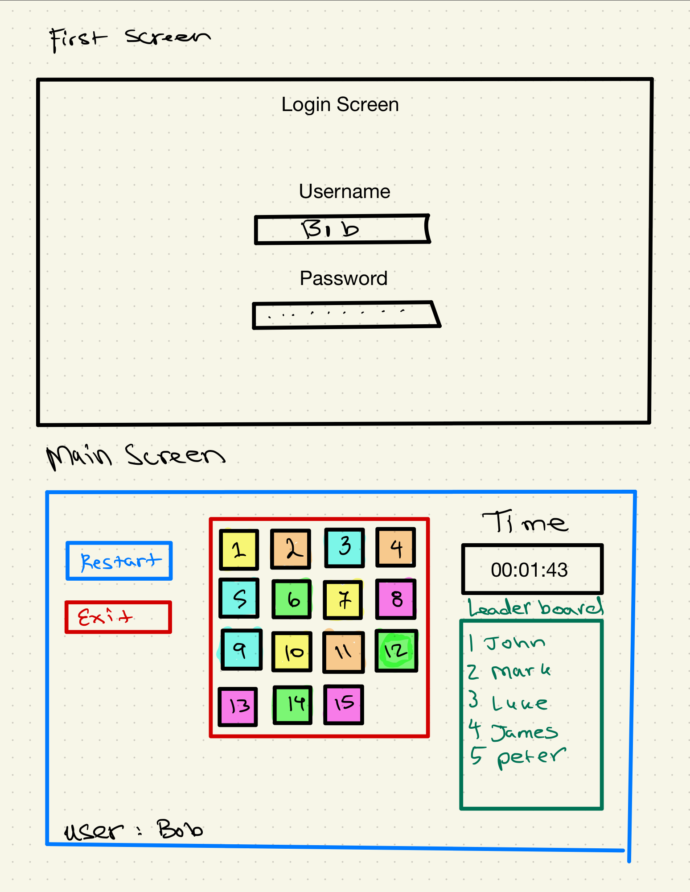

# Slider
## Description deliverable
### Elevator Pitch
Have you ever wanted to test your brain but not over exhert it? Now is your chance with the Web Application: Slider.
Slider is a simple, yet fulfilling puzzle that takes some time and effort to solve. The puzzle has 15 numbered sliders all aligned in a 4X4 square. 
The task is simply to organize the numbers in order from 1-15. You will be timed on your efforts and work to solve this puzzle as quickly as you can.
Will you be quickest to solve?
### Design

### Key Features
* Secure login over HTTPS
* Numbers scramble at start and when restart button is click
* Timer begins when first move is made and stops when complete
* Leaderboard shown and displayed in realtime
* Results are persistently stored

### Technologies
Here are the required technologies and how they will be used:
* **HTML** - Three HTML pages created. Use correct HTML structure for the pages. First page is for login. Second page is for game play and time score. Third page shows complete leaderboard and times. Hyperlinks to choice pages.
* **CSS** - Apply correct styling on pages. Specifically design the game to look smooth and playable.
* **JavaScript** - Provides login, display, and gameplay.
* **Service** - Backend service with endpoints for:
                - Login
* **DB** - Store players and time scores.
* **Login** - Login users. Previous users stored in DB and able to see their previous best.
* **Websocket** - When a player is working on the puzzle or completing a puzzle, they are broadcast for users to see.
* **React** - Application ported to use the React web framework.

